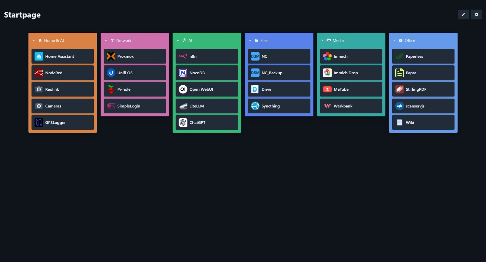
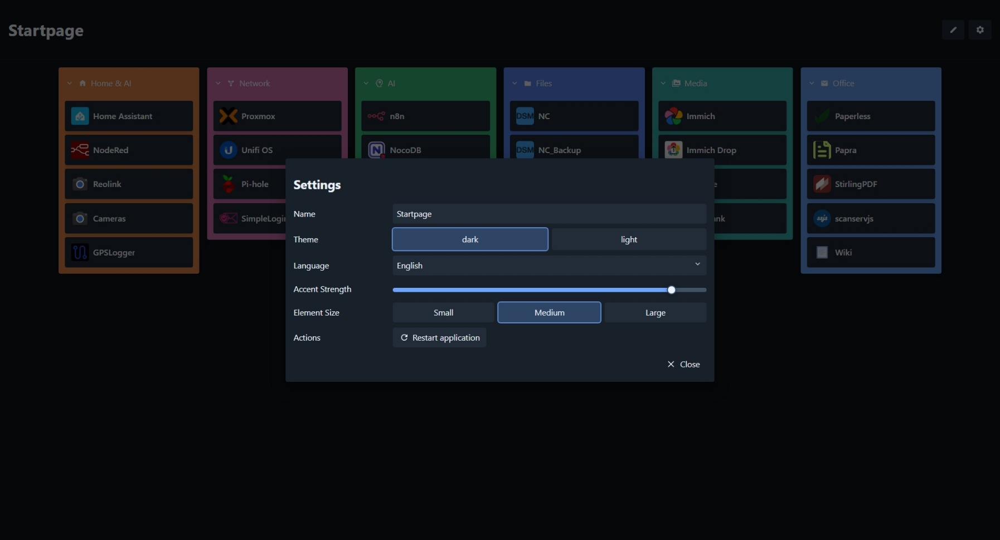

# Start


Minimal, extremely fast self hosted start page for homelabs, infrastructure and personal services.

No cloud.  
No database.  
No external CDNs.  
Just FastAPI + Vanilla JS.

---

## Screenshots

### Dashboard



### Settings



---

## Features

- Extremely fast local dashboard
- Modern responsive interface
- Fully local without cloud services
- Freely organize categories and services
- Drag and drop for categories and services
- Touch support with long press
- Light and dark theme
- Multi language support
- Local favicon cache
- Automatic JSON persistence
- Automatic backups on changes
- No database required
- No external frameworks
- Vanilla JavaScript frontend
- FastAPI backend
- Live settings without reload
- Adjustable category accent strength
- Adjustable element sizes
- Mobile optimized

---

## Philosophy

Start is intentionally simple.

- No user management
- No database
- No cloud dependencies
- No external APIs
- No tracking services
- No unnecessary frameworks

Everything runs locally, directly and extremely fast.

---

## Architecture

```text
Browser
   ↓
FastAPI Backend
   ↓
JSON Configuration
   ↓
Local Favicon Cache
```

### Backend

- FastAPI
- Python
- JSON persistence

### Frontend

- HTML
- CSS
- Vanilla JavaScript

### Storage

- `app/data/config.json`
- `app/data/settings.json`

---

## Installation

### Start directly

```bash
pip install -r requirements.txt
python app.py
```

Afterwards available at:

```text
http://127.0.0.1:8080
```

---

## Project Structure

```text
app/
├── data/
│   ├── config.json
│   ├── settings.json
│   └── backups/
├── static/
│   ├── css/
│   ├── js/
│   ├── themes/
│   ├── languages/
│   └── assets/
└── app.py
```

---

## Features in Detail

### Categories

- Freely configurable
- Selectable colors
- Expand and collapse support
- Drag and drop sorting
- Responsive grid layout

### Services

- Local or external URLs
- Automatic favicon detection
- Local favicon cache
- Drag and drop
- Open in current or new tab

### Settings

- Live theme switching
- Live language switching
- Adjustable category accent strength
- Adjustable element sizes
- Restart application directly from the UI

---

## Mobile Ready

Start works fully on:

- Desktop
- Tablet
- Smartphone

including:

- Touch drag and drop
- Long press support
- Responsive layout
- Mobile friendly interaction

---

## Data Safety

Local files containing potentially private data are excluded from version control:

```text
app/data/config.json
app/data/settings.json
app/data/backups/
app/static/assets/favicon-cache/
```

---

## Why Start?

Many dashboards are:
- too heavy
- framework overloaded
- cloud dependent
- unnecessarily complex

Start intentionally follows a different approach:

- local
- fast
- minimal
- direct
- low maintenance

---

## License

MIT License